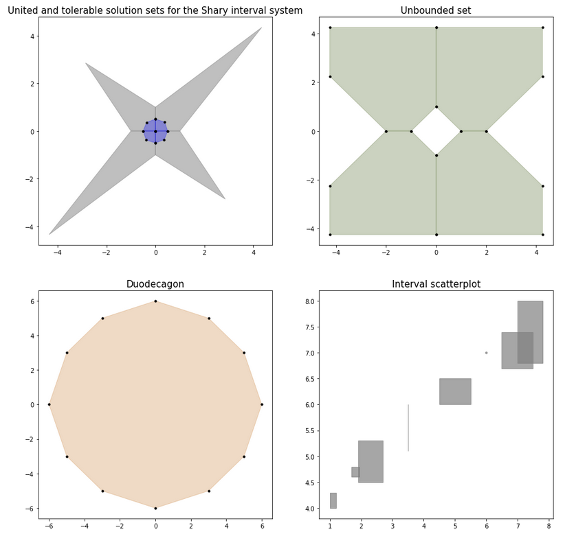

# Interval library in Python

Эта библиотека реализует общие [операции](https://ru.wikipedia.org/wiki/Интервальная_арифметика) над интервальными величинами, визуализацию множества решений, а также некоторые способы решения как линейных, так и нелинейных систем. 

Подробности см. в полной документации по [API](https://intvalpy.readthedocs.io/ru/latest/index.html).

## Установка

Убедитесь, что у вас есть все общесистемные зависимости:
```
sudo apt-get install cython libglpk-dev python python-dev python-pip python-scipy
```
Затем установите сам модуль:
```
pip install intvalpy
```

## Примеры 

### Визуализация множества решений

Мы можем вычислить список вершин выпуклого множества, описанного системой ``A * x >= b`` (в случае точечных данных) или ``A * x = b`` (в интервальном случае), а также визуализировать это множество:

```python
import intvalpy as ip

import numpy as np
import matplotlib.pyplot as plt

A1 = ip.Interval([[-1, -1],[-1, -1]], [[1,1], [-1,1]])
b1 = ip.Interval([1,-2], [1,2])

vertices = ip.IntLinIncR2(A1, b1)

A2 = -np.array([[-3, -1],
                [-2, -2],
                [-1, -3],
                [1, -3],
                [2, -2],
                [3, -1],
                [3, 1],
                [2, 2],
                [1, 3],
                [-1, 3],
                [-2, 2],
                [-3, 1]])
b2 = -np.array([18,16,18,18,16,18,18,16,18,18,16,18])

vertices = ip.lineqs(A2, b2, color='blue', alpha=0.2, size=(12,12))
```


### Интервальная система линейных алгебраических уравнений:

Мы можем решать ИСЛАУ методами Гаусса, Гаусса-Зейделя, а также методом дробления решений (PSS):

```
import intvalpy as ip

A = ip.Interval([[3.33, 0, 0], [0, 3.33, 0], [0, 0, 3.33]],
                [[3.33, 2, 2], [2, 3.33, 2], [2, 2, 3.33]])
b = ip.Interval([-1, -1, -1], [2, 2, 2])

ip.PSS(A, b)
# +-----+-----+-----+-----+-----+-----+-----+-----+-----+-----+-----+-----+-----+-----+-----+ #
# PSS(A, b)                                                                                   #
# interval(['[-3.667972, 3.451067]', '[-3.667972, 3.451067]', '[-3.667972, 3.451067]'])       #
# +-----+-----+-----+-----+-----+-----+-----+-----+-----+-----+-----+-----+-----+-----+-----+ #
```

### Интервальная система нелинейных уравнений:

В данной библиотеке также реализованы многомерные интервальные методы Кравчика и Хансена-Сенгупты, для решения нелинейных систем:

```
import intvalpy as ip

epsilon = 0.1
def f(x):
    return ip.asinterval([x[0]**2 + x[1]**2-1-ip.Interval(-epsilon, epsilon), 
                          x[0] - x[1]**2])

def J(x):    
    result = [[2*x[0], 2*x[1]],
              [1, -2*x[1]]]
    return ip.asinterval(result)

res = ip.HansenSengupta(f, J, ip.Interval([0.5,0.5],[1,1]))
print('Многомерная нелинейная задача: ', res)
# +-----+-----+-----+-----+-----+-----+-----+-----+-----+-----+-----+-----+-----+-----+-----+ #
# HansenSengupta(f, J, ip.Interval([0.5,0.5],[1,1]))                                          #
# Многомерная нелинейная задача:  interval(['[0.569485, 0.666583]', '[0.755144, 0.817158]'])  #
# +-----+-----+-----+-----+-----+-----+-----+-----+-----+-----+-----+-----+-----+-----+-----+ #
```

Ссылки
-----

* [Домашняя страница](<https://github.com/Maestross/intvalpy>)
* [Онлайн документация](<https://intvalpy.readthedocs.io/ru/latest/#>)
* [Пакет на PyPI](<https://pypi.org/project/intvalpy/>)
* [Теория](<http://www.nsc.ru/interval/Library/InteBooks/SharyBook.pdf>)
