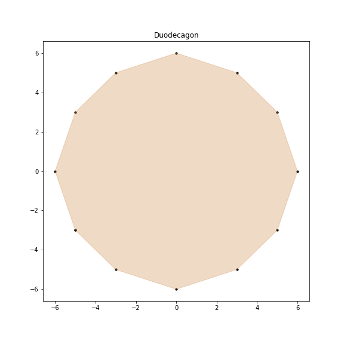
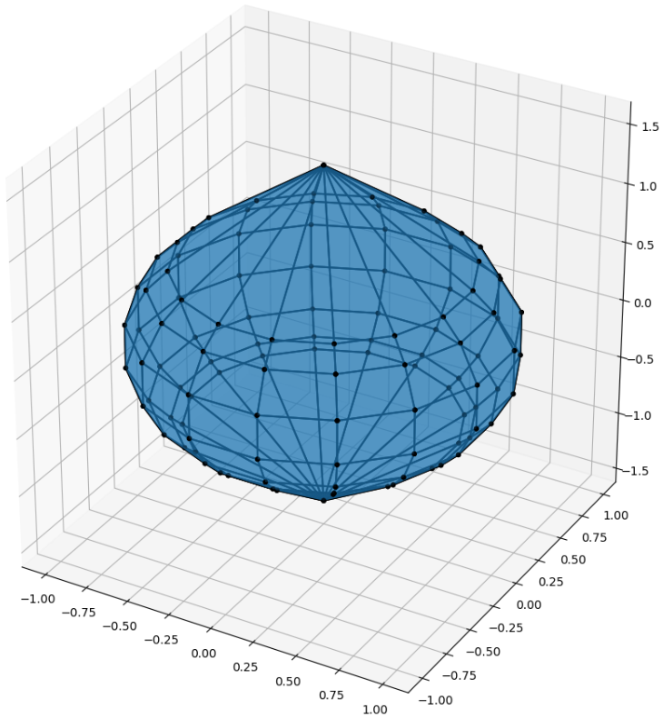
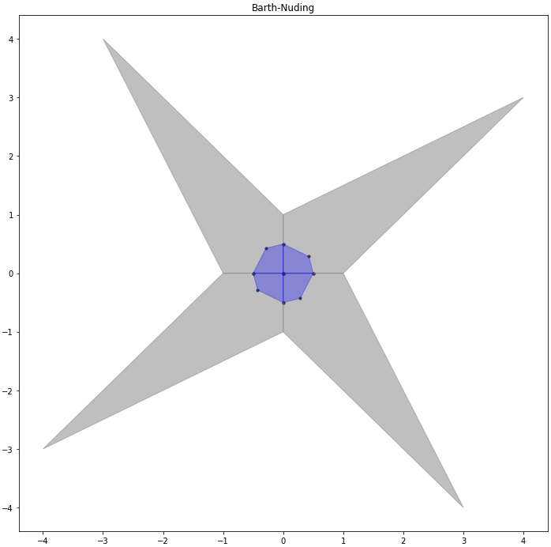
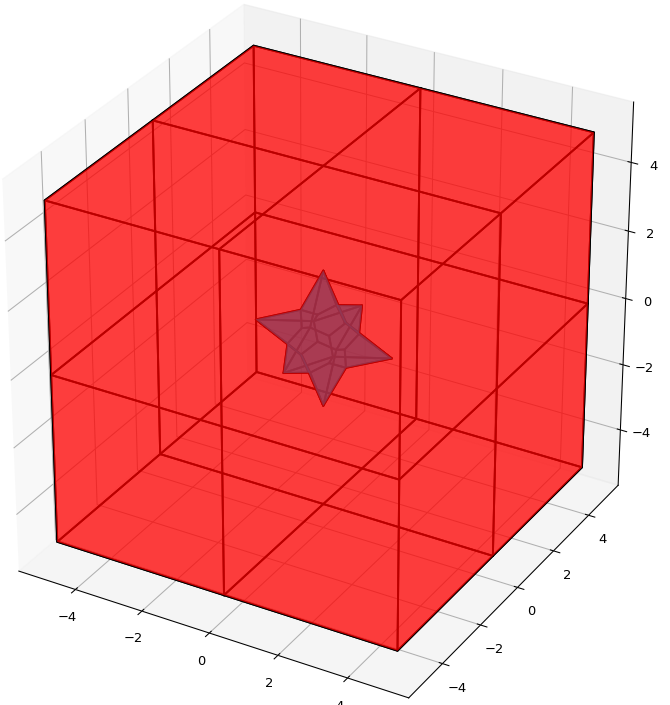

Линейные системы
===============

В данном параграфе представлен обзор функций для исследования разрешимости и получения оценки
множества решений интервальных линейных систем.

Выполните инструкцию для подключения необходимых модулей:

    >>> import intvalpy as ip
    >>> import numpy as np

.. Содержание::

Вариабельность системы
------------

При решении системы мы обычно получаем множество различных оценок, одинаково пригодных в качестве ответов к задаче
и согласующихся с её данными. Именно вариабельность характеризует то насколько мало или велико это множество.

Для получения количественной меры воспользуйтесь функцией ``ive``:

Parameters:
            A: Interval
                Матрица ИСЛАУ.

            b: Interval
                Вектор правой части ИСЛАУ.

Optional Parameters:
            N: int
                Количество угловых матриц для которых вычисляется обусловленность.

Returns:
            out: float
                Возвращается мера вариабельности IVE.

Пример:

>>> import intvalpy as ip
>>>
>>> inf = [[98, 99],
>>>        [97, 98],
>>>        [96, 97]]
>>>
>>> sup = [[100, 101],
>>>        [99, 100],
>>>        [98, 99]]
>>>
>>> A = ip.Interval(inf, sup)
>>> b = ip.Interval([190, 200, 190], [210, 220, 210])
>>>
>>> ip.linear.ive(A, b)
1.56304

Для ускорения расчётов был использован рандомизированный алгоритм.

Более подробную информацию Вы можете узнать из `статьи <http://www.nsc.ru/interval/shary/Papers/SShary-VariabMeasure-JCT.pdf>`_ Шарого С.П.

Распознающие функционалы
------------

Перед тем, как приступить к решению системы уравнений с интервальными данными необходимо понять, а разрешима ли она.
Для этого рассматривается задача о распознавании разрешимости, т.е. непустоты множества решений.
В случае интервальной линейной (m x n)-системы уравнений потребуется решить не более чем 2\ :sup:`n`
линейных неравенств размера 2m+n. Это следует из факта о выпуклости и многогранности пересечения множеств решений
интервальной системы линейных алгебраических уравнений (ИСЛАУ) с каждым из ортантов пространства **R**\ :sup:`n`.
Уменьшение количества неравенств принципиально невозможно, что следует из факта труднорешаемости задачи,
т.е. её NP-трудности. Ясно, что выше описанный метод применим лишь при малой размерности задачи,
поэтому был предложен *метод распознающего функционала*.

Распознающий функционал Uni
~~~~~~~~~~~~~~~~~~

В случае, когда необходимо проверить интервальную систему линейных уравнений на её слабую разрешимость
следует воспользоваться функционалом ``Uni``. Для его оптимизации используется широко известный метод Нелдера-Мида,
который не использует градиенты, поскольку в функции присутствует взятие абсолютного значения.

Parameters:
""""""""""""""""""

* A : Interval
            Входная интервальная матрица ИСЛАУ, которая может быть как квадратной, так и прямоугольной.

* b : Interval
            Интервальной вектор правой части ИСЛАУ.

* x : float, array_like, optional
            Точка в которой вычисляется распознающий функционал.
            По умолчанию x равен массиву из нулей.

* maxQ : bool, optional
            Если значение параметра равно True, то производится максимизация функционала.

* x0 : float, array_like, optional
            Первоначальная догадка для поиска глобального максимума.

* tol : float, optional
            Погрешность для прекращения оптимизационного процесса.

* maxiter : int, optional
            Максимальное количество итераций.

**Returns**:

* out: float, tuple
            Возвращается значение распознающего функционала в точке x.
            В случае, если maxQ=True, то возвращается кортеж, где
            первый элемент -- корректность завершения оптимизации,
            второй элемент -- точка оптимума,
            третий элемент -- значение функции в этой точке.

**Examples**:

В качестве примера рассмотрим широко известную интервальную систему, предложенную Бартом-Нудингом:

>>> A = ip.Interval([[2, -2],[-1, 2]], [[4,1],[2,4]])
>>> b = ip.Interval([-2, -2], [2, 2])

Для получения значения функции в конкретной точке необходимо выполнить следующую инструкцию

>>> x = np.array([1,2])
>>> ip.linear.Uni(A, b, x)
-1.0

Таким образом видно, что точка не лежит в множестве решений системы, т.к. значение распознающего функционала отрицательно.
Для получения глобального максимума функции, чтобы понять разрешима или не разрешима система, следует указать истинность значения параметра `maxQ`:

>>> ip.linear.Uni(A, b, maxQ=True)
(True, array([0., 0.]), 2.0)

Поскольку интервальная система линейна, но матрица **А** не является точечной, то нет гарантий, что был достигнут глобальный максимум функции.
В качестве некоторого решения пользователь может указать первоначальную догадку, исходя, например, из особенностей матрицы.
Это также может ускорить процесс поиска глобального максимума.

Распознающий функционал Tol
~~~~~~~~~~~~~~~~~~

В случае, когда необходимо проверить интервальную систему линейных уравнений на её сильную разрешимость
следует воспользоваться функционалом ``Tol``. Для его оптимизации используется проверенная временем программа `tolsolvty`,
которая пригодна для решения практических задач.

**Parameters**:

* A : Interval
            Входная интервальная матрица ИСЛАУ, которая может быть как квадратной, так и прямоугольной.

* b : Interval
            Интервальной вектор правой части ИСЛАУ.

* x : float, array_like, optional
            Точка в которой вычисляется распознающий функционал.
            По умолчанию x равен массиву из нулей.

* maxQ : bool, optional
            Если значение параметра равно True, то производится максимизация функционала.

* x0 : float, array_like, optional
            Первоначальная догадка для поиска глобального максимума.

* tol : float, optional
            Погрешность для прекращения оптимизационного процесса.

* maxiter : int, optional
            Максимальное количество итераций.

**Returns**:

* out: float, tuple
            Возвращается значение распознающего функционала в точке x.
            В случае, если maxQ=True, то возвращается кортеж, где
            первый элемент -- корректность завершения оптимизации,
            второй элемент -- точка оптимума,
            третий элемент -- значение функции в этой точке.

Examples:
""""""""""""""""""

В качестве примера рассмотрим широко известную интервальную систему, предложенную Бартом-Нудингом:

>>> A = ip.Interval([[2, -2],[-1, 2]], [[4,1],[2,4]])
>>> b = ip.Interval([-2, -2], [2, 2])

Для получения значения функции в конкретной точке необходимо выполнить следующую инструкцию

>>> x = np.array([1,2])
>>> ip.linear.Tol(A, b, x)
-8.0

Таким образом видно, что точка не лежит в множестве решений системы, т.к. значение распознающего функционала отрицательно.
Для получения глобального максимума функции, чтобы понять разрешима или не разрешима система, следует указать истинность значения параметра `maxQ`:

>>> ip.linear.Tol(A, b, maxQ=True)
(True, array([0., 0.]), 2.0)

Отличительным свойством функционала `Tol` от функционалов `Uni` и `Uss` является то, что вне зависимости от того является ли матрица **A**
интервальной или точечной, функционал всегда имеет только один экстремум. Таким образом не важно с какой начальной догадки начинать поиск.
Однако, если указать начальную точку, то поиск глобального максимума может ускориться.

Список использованной литературы
~~~~~~~~~~~~~~~~~~

[1] С.П. Шарый - `Разрешимость интервальных линейных уравнений и анализ данных с неопределённостями <http://www.nsc.ru/interval/shary/Papers/SharyAiT.pdf>`_ // Автоматика и Телемеханика, No 2, 2012

[2] С.П. Шарый, И.А. Шарая - `Распознавание разрешимости интервальных уравнений и его приложения к анализу данных <http://www.nsc.ru/interval/shary/Papers/Sharys-JCT2013.pdf>`_ // Вычислительные технологии, Том 18, No 3, 2013, стр. 80-109.

[3] С.П. Шарый - `Сильная согласованность в задаче восстановления зависимостей при интервальной неопределённости данных <http://www.nsc.ru/interval/shary/Papers/SShary-JCT-2017.pdf>`_ // Вычислительные технологии, Том 22, No 2, 2017, стр. 150-172.

Метод граничных интервалов
------------

В случае, когда появляется необходимость визуализировать множество решений системы линейных неравенств (или интервальную систему уравнений),
а также получить все вершины множество, можно прибегнуть к методам решения проблемы перечисления вершин. Однако существующие реализации
имеют ряд недостатков: работа только с квадратными системами, плохая обработка неограниченных множеств.

Основываясь на применении *матрицы граничных интервалов* был предложен *метод граничных интервалов* для исследования и визуализации полиэдральных множеств.
Главными преимуществами данного подхода является возможность работать с неограниченными и тощими множествами решений, а также с линейными системами,
когда количество уравнений отлично от количества неизвестных.

Для общего понимания работы алгоритма укажем его основные шаги:
::
    1. Формирование матрицы граничных интервалов;
    2. Изменение матрицы граничных интервалов с учётом окна отрисовки;
    3. Построение упорядоченных вершин полиэдрального множества решений;
    4. Вывод построенных вершин и (если надо) отрисовка полиэдра.

Двумерная визуализация линейной системы неравенств
~~~~~~~~~~~~~~~~~~

Для работы с линейной системой алгебраических неравенств A x >= b, когда количество неизвестных равно двум, необходимо
воспользоваться функций ``lineqs``. В случае, если множество решений неограниченно, то алгоритм самостоятельно выберет
границы отрисовки. Однако пользователь сам может указать их явным образом.

**Parameters**:

* A: float
            Матрица системы линейных алгебраических неравенств.

* b: float
            Вектор правой части системы линейных алгебраических неравенств.

* show: bool, optional
            Данный параметр отвечает за то будет ли показано множество решений.
            По умолчанию указано значение True, т.е. происходит отрисовка графика.

* title: str, optional
            Верхняя легенда графика.

* color: str, optional
            Цвет внутренней области множества решений.

* bounds: array_like, optional
            Границы отрисовочного окна. Первый элемент массива отвечает за нижние грани по осям OX и OY, а второй за верхние.
            Таким образом, для того, чтобы OX лежало в пределах [-2, 2], а OY в пределах [-3, 4], необходимо задать ``bounds`` как
            [[-2, -3], [2, 4]].

* alpha: float, optional
            Прозрачность графика.

* s: float, optional
            Насколько велики точки вершин.

* size: tuple, optional
            Размер отрисовочного окна.

* save: bool, optional
            Если значение True, то график сохраняется.

**Returns**:

* out: list
            Возвращается список упорядоченных вершин.
            В случае, если show = True, то график отрисовывается.

**Examples**:

В качестве примера предлагается рассмотреть систему описывающую двенадцатиугольник:

>>> A = -np.array([[-3, -1],
>>>               [-2, -2],
>>>               [-1, -3],
>>>               [1, -3],
>>>               [2, -2],
>>>               [3, -1],
>>>               [3, 1],
>>>               [2, 2],
>>>               [1, 3],
>>>               [-1, 3],
>>>               [-2, 2],
>>>               [-3, 1]])
>>> b = -np.array([18,16,18,18,16,18,18,16,18,18,16,18])
>>> vertices = ip.lineqs(A, b, title='Duodecagon', color='peru', alpha=0.3, size=(8,8))
array([[-5., -3.], [-6., -0.], [-5.,  3.], [-3.,  5.], [-0.,  6.], [ 3.,  5.],
       [ 5.,  3.], [ 6.,  0.], [ 5., -3.], [ 3., -5.], [ 0., -6.], [-3., -5.]])

Трёхмерная визуализация линейной системы неравенств
~~~~~~~~~~~~~~~~~~

Для работы с линейной системой алгебраических неравенств A x >= b, когда количество неизвестных равно трём, необходимо
воспользоваться функций ``lineqs3D``. В случае, если множество решений неограниченно, то алгоритм самостоятельно выберет
границы отрисовки. Однако пользователь сам может указать их явным образом. Для понимания, что множество решений обрезано,
плоскости окрашиваются в красный цвет.

**Parameters**:

* A: float
            Матрица системы линейных алгебраических неравенств.

* b: float
            Вектор правой части системы линейных алгебраических неравенств.

* show: bool, optional
            Данный параметр отвечает за то будет ли показано множество решений.
            По умолчанию указано значение True, т.е. происходит отрисовка графика.

* color: str, optional
            Цвет внутренней области множества решений.

* bounds: array_like, optional
            Границы отрисовочного окна. Первый элемент массива отвечает за нижние грани по осям OX, OY и OZ, а второй за верхние.
            Таким образом, для того, чтобы OX лежало в пределах [-2, 2], а OY в пределах [-3, 4], а OZ в пределах [1, 5]
            необходимо задать ``bounds`` как [[-2, -3, 1], [2, 4, 5]].

* alpha: float, optional
            Прозрачность графика.

* s: float, optional
            Насколько велики точки вершин.

* size: tuple, optional
            Размер отрисовочного окна.

**Returns**:

* out: list
            Возвращается список упорядоченных вершин.
            В случае, если show = True, то график отрисовывается.

**Examples**:

В качестве примера предлагается рассмотреть систему описывающую юлу:

>>> %matplotlib notebook
>>> k = 4
>>> A = []
>>> for alpha in np.arange(0, 2*np.pi - 0.0001, np.pi/(2*k)):
>>>     for beta in np.arange(-np.pi/2, np.pi/2, np.pi/(2*k)):
>>>         Ai = -np.array([np.sin(alpha), np.cos(alpha), np.sin(beta)])
>>>         Ai /= np.sqrt(Ai @ Ai)
>>>         A.append(Ai)
>>> A = np.array(A)
>>> b = -np.ones(A.shape[0])
>>>
>>> vertices = ip.lineqs3D(A, b)

Визуализация множества решений ИСЛАУ c двумя неизвестными
~~~~~~~~~~~~~~~~~~

Для работы с интервальной линейной системой алгебраических уравнений **A** x = **b**, когда количество неизвестных равно двум,
необходимо воспользоваться функций ``IntLinIncR2``.

Для построения множества решений разобьём основную задачу на четыре подзадачи. Для этого воспользуемся свойством выпуклости решения
в пересечении с каждым из ортантов пространства R\ :sup:`2`, а также характеризацей Бекка. В результате получим
задачи с системами линейных неравенств в каждом ортанте, которые можно визуализировать с помощью функции ``lineqs``.

В случае, если множество решений неограниченно, то алгоритм самостоятельно выберет границы отрисовки. Однако пользователь
сам может указать их явным образом.

**Parameters**:

* A : Interval
            Входная интервальная матрица ИСЛАУ, которая может быть как квадратной, так и прямоугольной.

* b : Interval
            Интервальной вектор правой части ИСЛАУ.

* show: bool, optional
            Данный параметр отвечает за то будет ли показано множество решений.
            По умолчанию указано значение True, т.е. происходит отрисовка графика.

* title: str, optional
            Верхняя легенда графика.

* consistency: str, optional
            Параметр для выбора типа множества решений. В случае, если он равен consistency = 'uni', то функция возвращает
            объединённое множество решение, если consistency = 'tol', то допусковое.

* bounds: array_like, optional
            Границы отрисовочного окна. Первый элемент массива отвечает за нижние грани по осям OX и OY, а второй за верхние.
            Таким образом, для того, чтобы OX лежало в пределах [-2, 2], а OY в пределах [-3, 4], необходимо задать ``bounds`` как
            [[-2, -3], [2, 4]].

* color: str, optional
            Цвет внутренней области множества решений.

* alpha: float, optional
            Прозрачность графика.

* s: float, optional
            Насколько велики точки вершин.

* size: tuple, optional
            Размер отрисовочного окна.

* save: bool, optional
            Если значение True, то график сохраняется.

**Returns**:

* out: list
            Возвращается список упорядоченных вершин в каждом ортанте
            начиная с первого и совершая обход в положительном направлении.
            В случае, если show = True, то график отрисовывается.

**Examples**:

В качестве примера предлагается рассмотреть широкоизвестную интервальную систему предложенную Бартом-Нудингом.
Для наглядности насколько отличаются разные типы решений изобразим на одном графике объединённое и допусковое множества:

>>> import matplotlib.pyplot as plt
>>>
>>> A = ip.Interval([[2, -2],[-1, 2]], [[4,1],[2,4]])
>>> b = ip.Interval([-2, -2], [2, 2])
>>>
>>> fig = plt.figure(figsize=(12,12))
>>> ax = fig.add_subplot(111, title='Barth-Nuding')
>>>
>>> vertices1 = ip.IntLinIncR2(A, b, show=False)
>>> vertices2 = ip.IntLinIncR2(A, b, consistency='tol', show=False)
>>>
>>> for v in vertices1:
>>>     # если пересечение с ортантом не пусто
>>>     if len(v) > 0:
>>>         x, y = v[:,0], v[:,1]
>>>         ax.fill(x, y, linestyle = '-', linewidth = 1, color='gray', alpha=0.5)
>>>         ax.scatter(x, y, s=0, color='black', alpha=1)
>>>
>>> for v in vertices2:
>>>     # если пересечение с ортантом не пусто
>>>     if len(v) > 0:
>>>         x, y = v[:,0], v[:,1]
>>>         ax.fill(x, y, linestyle = '-', linewidth = 1, color='blue', alpha=0.3)
>>>         ax.scatter(x, y, s=10, color='black', alpha=1)

Визуализация множества решений ИСЛАУ c тремя неизвестными
~~~~~~~~~~~~~~~~~~

Для работы с интервальной линейной системой алгебраических уравнений **A** x = **b**, когда количество неизвестных равно трём,
необходимо воспользоваться функций ``IntLinIncR3``.

Для построения множества решений разобьём основную задачу на восемь подзадач. Для этого воспользуемся свойством выпуклости решения
в пересечении с каждым из ортантов пространства R\ :sup:`3`, а также характеризацей Бекка. В результате получим
задачи с системами линейных неравенств в каждом ортанте, которые можно визуализировать с помощью функции ``lineqs3D``.

В случае, если множество решений неограниченно, то алгоритм самостоятельно выберет
границы отрисовки. Однако пользователь сам может указать их явным образом. Для понимания, что множество решений обрезано,
плоскости окрашиваются в красный цвет.

**Parameters**:

        * A : Interval
            Входная интервальная матрица ИСЛАУ, которая может быть как квадратной, так и прямоугольной.

        * b : Interval
            Интервальной вектор правой части ИСЛАУ.

        * show: bool, optional
            Данный параметр отвечает за то будет ли показано множество решений.
            По умолчанию указано значение True, т.е. происходит отрисовка графика.

        * consistency: str, optional
            Параметр для выбора типа множества решений. В случае, если он равен consistency = 'uni', то функция возвращает
            объединённое множество решение, если consistency = 'tol', то допусковое.

        * bounds: array_like, optional
            Границы отрисовочного окна. Первый элемент массива отвечает за нижние грани по осям OX, OY и OZ, а второй за верхние.
            Таким образом, для того, чтобы OX лежало в пределах [-2, 2], а OY в пределах [-3, 4], а OZ в пределах [1, 5]
            необходимо задать ``bounds`` как [[-2, -3, 1], [2, 4, 5]].

        * color: str, optional
            Цвет внутренней области множества решений.

        * alpha: float, optional
            Прозрачность графика.

        * s: float, optional
            Насколько велики точки вершин.

        * size: tuple, optional
            Размер отрисовочного окна.

**Returns**:

        * out: list
            Возвращается список упорядоченных вершин в каждом ортанте.
            В случае, если show = True, то график отрисовывается.

**Examples**:

В качестве примера рассмотрим интервальную систему у которой решением является вся область за исключением внутренности:

>>> %matplotlib notebook
>>> inf = np.array([[-1,-2,-2], [-2,-1,-2], [-2,-2,-1]])
>>> sup = np.array([[1,2,2], [2,1,2], [2,2,1]])
>>> A = ip.Interval(inf, sup)
>>> b = ip.Interval([2,2,2], [2,2,2])
>>>
>>> bounds = [[-5, -5, -5], [5, 5, 5]]
>>> vertices = ip.IntLinIncR3(A, b, alpha=0.5, s=0, bounds=bounds, size=(11,11))

Список использованной литературы
~~~~~~~~~~~~~~~~~~

[1] И.А. Шарая - `Метод граничных интервалов для визуализации полиэдральных множеств решений <http://www.nsc.ru/interval/sharaya/Papers/Sharaya-JCT2015.pdf>`_ // Вычислительные технологии, Том 20, No 1, 2015, стр. 75-103.

[2] П.А. Щербина - `Метод граничных интервалов в свободной системе компьютерной математики Scilab <http://www.nsc.ru/interval/Education/StudWorks/Shcherbina-diplom.pdf>`_

[3] С.П. Шарый - `монография <http://www.nsc.ru/interval/Library/InteBooks/SharyBook.pdf>`_.

Методы для решения квадратных систем
------------

В данном разделе предложены алгоритмы для решения квадратных интервальных систем уравнений.

Метод Гаусса
~~~~~~~~~~~~~~~~~~

Метод исключения Гаусса, включая его различные модификации, крайне популярный алгортим в вычислительной линейной алгебре.
Поэтому предлагается рассмотреть его интервальную версию, которая также состоит из двух этапов — *прямой ход* и *обратный ход*.

**Parameters**:

* A : Interval
            Входная интервальная матрица ИСЛАУ, которая должна быть квадратной.

* b : Interval
            Интервальной вектор правой части ИСЛАУ.

**Returns**:

* out : Interval
    Интервальный вектор, который после подстановки в систему уравнений и выполнения всех операций по правилам арифметики и анализа обращает уравнения в инстинные равенства.

**Examples**:

В качестве примера рассмотрим широко известную интервальную систему, предложенную Бартом-Нудингом:

>>> A = ip.Interval([[2, -2],[-1, 2]], [[4, 1],[2, 4]])
>>> b = ip.Interval([-2, -2], [2, 2])
>>> ip.linear.Gauss(A, b)
interval(['[-5.0, 5.0]', '[-4.0, 4.0]'])

Метод Гаусса-Зейделя
~~~~~~~~~~~~~~~~~~

Итерационный метод Гаусса-Зейделя для решения ИСЛАУ. 

**Parameters**:

* A : Interval
            Входная интервальная матрица ИСЛАУ, которая должна быть квадратной.

* b : Interval
            Интервальной вектор правой части ИСЛАУ.

* x0: Interval, optional
            Первоначальная догадка для поиска решения.

* P: Interval, optional
            Матрица предобуславливания.
            В случае, если параметр не задан, то берётся обратное среднее.

* tol : float, optional
            Погрешность, определающая, когда дальнейшее дробление брусов излишне, т.е. их ширина "достаточно близка" к нулю, что может считаться точно нулевой.

* maxiter : int, optional
            Максимальное количество итераций для выполнения алгоритма.

**Returns**:

* out : Interval
    Интервальный вектор, который после подстановки в систему уравнений и выполнения всех операций по правилам арифметики и анализа обращает уравнения в инстинные равенства.

**Examples**:

Рассмотрим интервальную линейную систему:

>>> A = ip.Interval([[2, -2],[-1, 2]], [[4, 1],[2, 4]])
>>> b = ip.Interval([1, 1], [2, 2])
>>> ip.linear.Gauss_Seidel(A, b)
Interval(['[-10.6623, 12.5714]', '[-11.0649, 12.4286]'])

При предобуславливании системы обратным среднем полученный вектор внешнего оценивания несколько шире, чем если заранее позаботиться и подобрать специального вида матрицу для предобуславливания.
Ниже предложена таже самая система, но уже предобуславлена иным способом:

>>> A = ip.Interval([[0.5, -0.456], [-0.438, 0.624]],
>>>                  [[1.176, 0.448], [0.596, 1.36]])
>>> b = ip.Interval([0.316, 0.27], [0.632, 0.624])
>>> ip.linear.Gauss_Seidel(A, b, P=False)
interval(['[-4.266757, 6.076814]', '[-5.371444, 5.265456]'])

Список использованной литературы
~~~~~~~~~~~~~~~~~~

[1] R.B. Kearfott, C. Hu, M. Novoa III - `A review of preconditioners for the interval Gauss-Seidel method <https://www.researchgate.net/publication/2656909_A_Review_of_Preconditioners_for_the_Interval_Gauss-Seidel_Method>`_ // Interval Computations 1991-1 pp 59-85

[2] С.П. Шарый - `монография <http://www.nsc.ru/interval/Library/InteBooks/SharyBook.pdf>`_.

Методы для решения переопределённых систем
------------
В случаях, когда рассматривается переопределённая интервальная система линейных алгебраических уравнений (ИСЛАУ), то
если отбросить некоторые уравнения, чтобы привести систему к квадратному виду, то полученный вектор-решение будет содержать оптимальное оценивания множества решений.
Однако такой приём может значительно ухудшить (раздуть) оценку, что, несомненно,  является нежелательным. В связи с этим предлагается рассмотреть некоторые алгоритмы для
решения переопределённых систем.

Метод Рона
~~~~~~~~~~~~~~~~~~

Метод, предложенный Дж. Роном в статье [1], для получения вектора-решения, основан на решении вспомогательного квадратного линейного неравенства.
Для получения данного неравенства активно используется наиболее представительная точечная матрица Аc из интеварльной матрицы **A**, т.е. Ac = mid(**A**).
Реализованный алгоритм является простейшей вариацией алгоритма предложенного в статье и *не* даёт оптимальное оценивание множества решений.

**Parameters**:

* A : Interval
            Входная интервальная матрица ИСЛАУ, которая может быть как квадратной, так и прямоугольной.

* b : Interval
            Интервальной вектор правой части ИСЛАУ.

* tol : float, optional
            Погрешность, определающая, когда дальнейшее дробление брусов излишне, т.е. их ширина "достаточно близка" к нулю, что может считаться точно нулевой.

* maxiter : int, optional
            Максимальное количество итераций для выполнения алгоритма.

**Returns**:

* out : Interval
    Интервальный вектор, который после подстановки в систему уравнений и выполнения всех операций по правилам арифметики и анализа обращает уравнения в инстинные равенства.

**Examples**:

В качестве примера рассмотрим широко известную интервальную систему, предложенную Бартом-Нудингом:

>>> A = ip.Interval([[2, -2],[-1, 2]], [[4,1],[2,4]])
>>> b = ip.Interval([-2, -2], [2, 2])
>>> ip.linear.Rohn(A, b)
Interval(['[-14, 14]', '[-14, 14]'])

Этот пример также демонстрирует, что решение может быть далеко от оптимального, который в данном случае равен Interval(['[-4, 4]', '[-4, 4]']).
В качестве второго примера предлагается рассмотреть тестовую систему С.П. Шарого:

>>> A, b = ip.Shary(4)
>>> ip.linear.Rohn(A, b)
Interval(['[-4.34783, 4.34783]', '[-4.34783, 4.34783]', '[-4.34783, 4.34783]', '[-4.34783, 4.34783]'])

В отличие от прошлого примера данный вектор-решение достаточно близок к оптимальному внешнему оцениванию.

Метод дробления решений
~~~~~~~~~~~~~~~~~~

Гибридный метод дробления решений PSS, подробно описанный в [2]. PSS-алгортимы предназначены для нахождения внешних оптимальных оценок множеств решений
интервальных систем линейных алгебраических уравнений (ИСЛАУ) **A** x = **b**.

В качестве базового метода внешнего оценивания в программе используется интервальный метод Гаусса (функция Gauss), если система является квадратной.
В случае, если система переопределённая, то применяется простейший алгоритм, предложенный Дж. Роном (функция Rohn). Поскольку задача NP-трудная,
то остановка процесса может произойти по количеству пройденных итераций. PSS-методы являются последовательно гарантирующими, т.е. при обрыве процесса
на любом количестве итераций приближённая оценка решения удовлетворяет требуемому способу оценивания.

Возвращает формальное решение интервальной системы линейных уравнений. В случае, если оценивать все компоненты нет необходимости, то можно оценить одну любую nu-ю компоненту.

**Parameters**:

* A : Interval
            Входная интервальная матрица ИСЛАУ, которая может быть как квадратной, так и прямоугольной.

* b : Interval
            Интервальной вектор правой части ИСЛАУ.

* tol : float, optional
            Погрешность, определающая, когда дальнейшее дробление брусов излишне, т.е. их ширина "достаточно близка" к нулю, что может считаться точно нулевой.

* maxiter : int, optional
            Максимальное количество итераций для выполнения алгоритма.

* nu : int, optional
            Выбор номера компоненты, вдоль которой оценивается множество решений.

**Returns**:

* out : Interval
    Интервальный вектор, который после подстановки в систему уравнений и выполнения всех операций по правилам арифметики и анализа обращает уравнения в инстинные равенства.

**Examples**:

>>> A, b = ip.Shary(4)
>>> ip.linear.PSS(A, b)
interval(['[-4.347826, 4.347826]', '[-4.347826, 4.347826]', '[-4.347826, 4.347826]', '[-4.347826, 4.347826]'])

Возврат интервального вектора решения NP-трудной системы.

>>> A, b = ip.Neumeier(3, 3.33)
>>> ip.linear.PSS(A, b, nu=0, maxiter=5000)
interval(['[-2.373013, 2.373013]'])

Возвращена отдельная компонента. В связи с тем, что в системе Ноймаера параметр theta=3.33 является жёстким условием, необходимо увеличить количество итераций для получения оптимальной оценки.

Список использованной литературы
~~~~~~~~~~~~~~~~~~

[1] J. Rohn - `Enclosing solutions of overdetermined systems of linear interval equations <http://uivtx.cs.cas.cz/~rohn/publist/88.pdf>`_ // Reliable Computing 2 (1996), 167-171

[2] С.П. Шарый - `монография <http://www.nsc.ru/interval/Library/InteBooks/SharyBook.pdf>`_.

[3] J. Horacek, M. Hladik - `Computing enclosures of overdetermined interval linear systems <https://www.researchgate.net/publication/236203844_Computing_Enclosures_of_Overdetermined_Interval_Linear_Systems>`_ // Reliable Computing 2 (2013), 142-155
