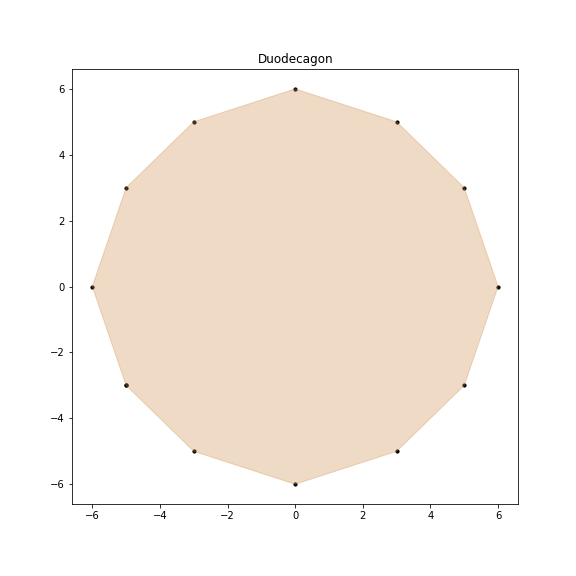
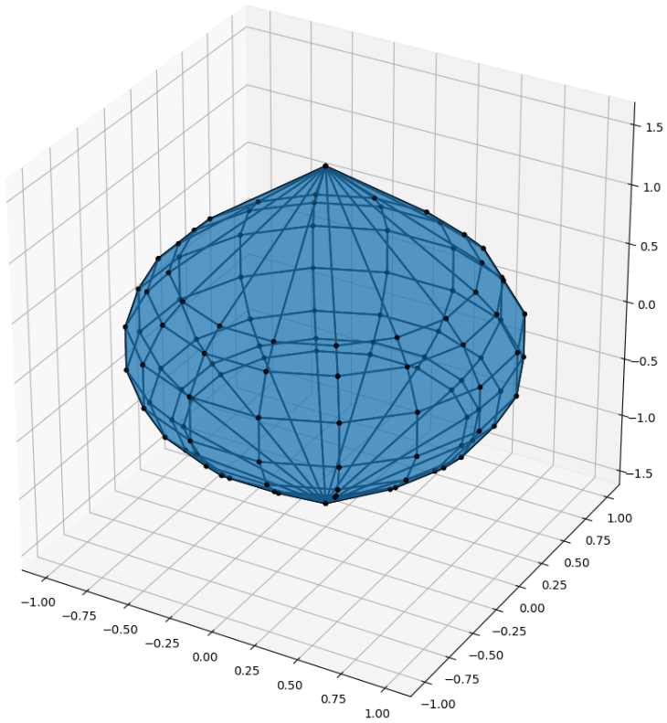
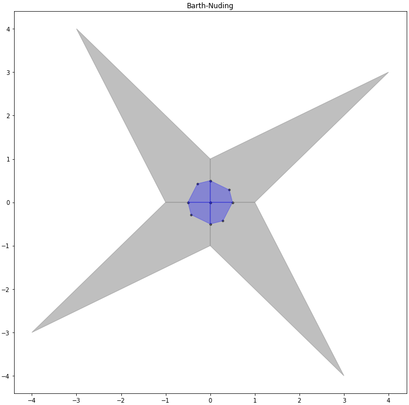
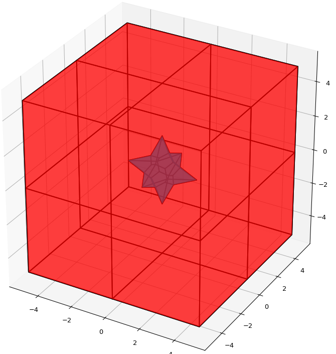

Interval Linear Systems
=======================

This section provides an overview of functions for obtaining estimates of the solution set for interval 
linear systems.

First, connect the necessary modules:

.. code-block:: python

    >>> import intvalpy as ip
    >>> import numpy as np

.. Contents::

Solution Variability
--------------------

**def ive(A, b, N=40)**

When solving a system, we typically obtain many different estimates, all equally valid as answers 
to the problem and consistent with the given data. Variability characterizes how small or large this 
solution set is.

To obtain a quantitative measure, use the `ive` function:

**Parameters**:

* **A** : Interval
    The input interval matrix of the interval system of linear algebraic equations (ISLAE), which can be 
    either square or rectangular.
* **b** : Interval
    The interval right-hand side vector of the ISLAE.
* **N** : int, optional
    The number of corner matrices for which the condition number is calculated. By default, N = 40.

**Returns**:

* **out** : float
    A measure of the variability of an interval system of linear equations, denoted IVE.

**Notes**:

A randomized algorithm is used to speed up calculations, so there is a chance that a non-optimal value 
might be found. To mitigate this, you can increase the value of the parameter `N`.

**Examples**:

.. code-block:: python

    >>> A = ip.Interval([
    ...     [[98, 100], [99, 101]],
    ...     [[97, 99], [98, 100]],
    ...     [[96, 98], [97, 99]]
    ... ])
    >>> b = ip.Interval([[190, 210], [200, 220], [190, 210]])
    >>> ip.linear.ive(A, b, N=60)
    1.56304

For more information, see the `article by S.P. Shary <http://www.nsc.ru/interval/shary/Papers/SShary-VariabMeasure-JCT.pdf>`_.

The Boundary Intervals Method
-----------------------------

When it becomes necessary to visualize the solution set of a system of linear inequalities (or an interval 
system of equations) and obtain all vertices of the set, one can resort to methods for solving the vertex 
enumeration problem. However, existing implementations have several drawbacks: they only work with square 
systems and handle unbounded sets poorly.

Based on the application of the *boundary intervals matrix*, the *boundary intervals method* was proposed 
for studying and visualizing polyhedral sets. The main advantages of this approach are its ability to work 
with unbounded and thin solution sets, as well as linear systems where the number of equations differs 
from the number of unknowns.

The main steps of the algorithm are:

1. Formation of the boundary intervals matrix;
2. Modification of the boundary intervals matrix considering the plotting window;
3. Construction of ordered vertices of the polyhedral solution set;
4. Output of the constructed vertices and (if necessary) rendering of the polyhedron.

2D Visualization of a Linear Inequality System
~~~~~~~~~~~~~~~~~~~~~~~~~~~~~~~~~~~~~~~~~~~~~~

To work with a system of linear algebraic inequalities **A x >= b** in two unknowns, use the ``lineqs`` 
function. If the solution set is unbounded, the algorithm will automatically choose plotting boundaries. 
However, the user can specify them explicitly.

**Parameters**:

* **A**: float
    The matrix of the system of linear algebraic inequalities.
* **b**: float
    The right-hand side vector of the system of linear algebraic inequalities.
* **show**: bool, optional
    If `True`, the solution set is plotted. Default is `True`.
* **title**: str, optional
    The title of the plot.
* **color**: str, optional
    The fill color for the solution set.
* **bounds**: array_like, optional
    The boundaries of the plotting window. The first element of the array corresponds to the lower bounds 
    for the OX and OY axes, and the second to the upper bounds. For example, to set OX in the range [-2, 2] 
    and OY in [-3, 4], use ``bounds=[[-2, -3], [2, 4]]``.
* **alpha**: float, optional
    The transparency of the plot.
* **s**: float, optional
    The size of the vertex points.
* **size**: tuple, optional
    The size of the plotting window (width, height).
* **save**: bool, optional
    If `True`, the plot is saved.

**Returns**:

* **out**: list
    A list of ordered vertices. If `show=True`, the plot is also displayed.

**Examples**:

Consider a system describing a dodecagon:

.. code-block:: python

    >>> A = -np.array([[-3, -1],
    ...               [-2, -2],
    ...               [-1, -3],
    ...               [1, -3],
    ...               [2, -2],
    ...               [3, -1],
    ...               [3, 1],
    ...               [2, 2],
    ...               [1, 3],
    ...               [-1, 3],
    ...               [-2, 2],
    ...               [-3, 1]])
    >>> b = -np.array([18,16,18,18,16,18,18,16,18,18,16,18])
    >>> vertices = ip.lineqs(A, b, title='Duodecagon', color='peru', alpha=0.3, size=(8,8))
    array([[-5., -3.], [-6., -0.], [-5.,  3.], [-3.,  5.], [-0.,  6.], [ 3.,  5.],
           [ 5.,  3.], [ 6.,  0.], [ 5., -3.], [ 3., -5.], [ 0., -6.], [-3., -5.]])

3D Visualization of a Linear Inequality System
~~~~~~~~~~~~~~~~~~~~~~~~~~~~~~~~~~~~~~~~~~~~~~

To work with a system of linear algebraic inequalities **A x >= b** in three unknowns, use the ``lineqs3D`` 
function. If the solution set is unbounded, the algorithm will automatically choose plotting boundaries. 
However, the user can specify them explicitly. To indicate that the solution set is truncated 
by the plotting window, the clipping planes are colored red.

**Parameters**:

* **A**: float
    The matrix of the system of linear algebraic inequalities.
* **b**: float
    The right-hand side vector of the system of linear algebraic inequalities.
* **show**: bool, optional
    If `True`, the solution set is plotted. Default is `True`.
* **color**: str, optional
    The fill color for the solution set.
* **bounds**: array_like, optional
    The boundaries of the plotting window. The first element corresponds to the lower bounds for the OX, OY, 
    and OZ axes, and the second to the upper bounds. For example, to set OX in [-2, 2], OY in [-3, 4], 
    and OZ in [1, 5], use ``bounds=[[-2, -3, 1], [2, 4, 5]]``.
* **alpha**: float, optional
    The transparency of the plot.
* **s**: float, optional
    The size of the vertex points.
* **size**: tuple, optional
    The size of the plotting window (width, height).

**Returns**:

* **out**: list
    A list of ordered vertices. If `show=True`, the plot is also displayed.

**Examples**:

Consider a system describing a "spinning top" (Yula):

.. code-block:: python

    >>> %matplotlib notebook
    >>> k = 4
    >>> A = []
    >>> for alpha in np.arange(0, 2*np.pi - 0.0001, np.pi/(2*k)):
    ...     for beta in np.arange(-np.pi/2, np.pi/2, np.pi/(2*k)):
    ...         Ai = -np.array([np.sin(alpha), np.cos(alpha), np.sin(beta)])
    ...         Ai /= np.sqrt(Ai @ Ai)
    ...         A.append(Ai)
    >>> A = np.array(A)
    >>> b = -np.ones(A.shape[0])
    >>>
    >>> vertices = ip.lineqs3D(A, b)

Visualizing the Solution Set of an ISLAE with Two Unknowns
~~~~~~~~~~~~~~~~~~~~~~~~~~~~~~~~~~~~~~~~~~~~~~~~~~~~~~~~~~

To work with an interval linear system of algebraic equations **A x = b** in two unknowns, use the ``IntLinIncR2`` function.

To construct the solution set, the main problem is divided into four subproblems. This utilizes the convexity 
property of the solution within each orthant of **R**\ :sup:`2` and the Beeck characterization. This results 
in systems of linear inequalities in each orthant, which can be visualized using the ``lineqs`` function.

If the solution set is unbounded, the algorithm will automatically choose plotting boundaries. However, 
the user can specify them explicitly.

**Parameters**:

* **A** : Interval
    The input interval matrix of the ISLAE, which can be square or rectangular.
* **b** : Interval
    The interval right-hand side vector of the ISLAE.
* **show**: bool, optional
    If `True`, the solution set is plotted. Default is `True`.
* **title**: str, optional
    The title of the plot.
* **consistency**: str, optional
    Parameter for selecting the type of solution set. If `consistency='uni'`, the function returns the united solution set. 
    If `consistency='tol'`, it returns the tolerable solution set.
* **bounds**: array_like, optional
    The boundaries of the plotting window. The first element corresponds to the lower bounds for the OX and OY axes, 
    and the second to the upper bounds. For example, to set OX in [-2, 2] and OY in [-3, 4], use ``bounds=[[-2, -3], [2, 4]]``.
* **color**: str, optional
    The fill color for the solution set.
* **alpha**: float, optional
    The transparency of the plot.
* **s**: float, optional
    The size of the vertex points.
* **size**: tuple, optional
    The size of the plotting window (width, height).
* **save**: bool, optional
    If `True`, the plot is saved.

**Returns**:

* **out**: list
    Returns a list of ordered vertices in each orthant, starting from the first and moving in a positive direction. 
    If `show=True`, the plot is also displayed.

**Examples**:

Consider the well-known interval system proposed by Barth-Nuding. To illustrate how different solution types vary, 
plot the united and tolerable sets on the same graph:

.. code-block:: python

    >>> import matplotlib.pyplot as plt
    >>>
    >>> A = ip.Interval([[2, -2],[-1, 2]], [[4,1],[2,4]])
    >>> b = ip.Interval([-2, -2], [2, 2])
    >>>
    >>> fig = plt.figure(figsize=(12,12))
    >>> ax = fig.add_subplot(111, title='Barth-Nuding')
    >>>
    >>> vertices1 = ip.IntLinIncR2(A, b, show=False)
    >>> vertices2 = ip.IntLinIncR2(A, b, consistency='tol', show=False)
    >>>
    >>> for v in vertices1:
    ...     if len(v) > 0:  # if intersection with the orthant is not empty
    ...         x, y = v[:,0], v[:,1]
    ...         ax.fill(x, y, linestyle='-', linewidth=1, color='gray', alpha=0.5)
    ...         ax.scatter(x, y, s=0, color='black', alpha=1)
    >>>
    >>> for v in vertices2:
    ...     if len(v) > 0:
    ...         x, y = v[:,0], v[:,1]
    ...         ax.fill(x, y, linestyle='-', linewidth=1, color='blue', alpha=0.3)
    ...         ax.scatter(x, y, s=10, color='black', alpha=1)

Visualizing the Solution Set of an ISLAE with Three Unknowns
~~~~~~~~~~~~~~~~~~~~~~~~~~~~~~~~~~~~~~~~~~~~~~~~~~~~~~~~~~~~

To work with an interval linear system of algebraic equations **A x = b** in three unknowns, use the ``IntLinIncR3`` function.

To construct the solution set, the main problem is divided into eight subproblems. This utilizes the convexity property 
of the solution within each orthant of **R**\ :sup:`3` and the Beeck characterization. This results in systems of linear 
inequalities in each orthant, which can be visualized using the ``lineqs3D`` function.

If the solution set is unbounded, the algorithm will automatically choose plotting boundaries. However, the user can specify 
them explicitly. To indicate that the solution set is truncated by the plotting window, the clipping planes are colored red.

**Parameters**:

* **A** : Interval
    The input interval matrix of the ISLAE, which can be square or rectangular.
* **b** : Interval
    The interval right-hand side vector of the ISLAE.
* **show**: bool, optional
    If `True`, the solution set is plotted. Default is `True`.
* **consistency**: str, optional
    Parameter for selecting the type of solution set. If `consistency='uni'`, the function returns the united solution set. 
    If `consistency='tol'`, it returns the tolerable solution set.
* **bounds**: array_like, optional
    The boundaries of the plotting window. The first element corresponds to the lower bounds for the OX, OY, and OZ axes, 
    and the second to the upper bounds. For example, to set OX in [-2, 2], OY in [-3, 4], and OZ in [1, 5], 
    use ``bounds=[[-2, -3, 1], [2, 4, 5]]``.
* **color**: str, optional
    The fill color for the solution set.
* **alpha**: float, optional
    The transparency of the plot.
* **s**: float, optional
    The size of the vertex points.
* **size**: tuple, optional
    The size of the plotting window (width, height).

**Returns**:

* **out**: list
    Returns a list of ordered vertices in each orthant. If `show=True`, the plot is also displayed.

**Examples**:

Consider an interval system where the solution is the entire region except the interior:

.. code-block:: python

    >>> %matplotlib notebook
    >>> inf = np.array([[-1,-2,-2], [-2,-1,-2], [-2,-2,-1]])
    >>> sup = np.array([[1,2,2], [2,1,2], [2,2,1]])
    >>> A = ip.Interval(inf, sup)
    >>> b = ip.Interval([2,2,2], [2,2,2])
    >>>
    >>> bounds = [[-5, -5, -5], [5, 5, 5]]
    >>> vertices = ip.IntLinIncR3(A, b, alpha=0.5, s=0, bounds=bounds, size=(11,11))

References for the Boundary Intervals Method
~~~~~~~~~~~~~~~~~~~~~~~~~~~~~~~~~~~~~~~~~~~~

[1] I.A. Sharaya - `Boundary intervals method for visualization of polyhedral solution sets <http://www.nsc.ru/interval/sharaya/Papers/Sharaya-JCT2015.pdf>`_ // Computational Technologies, Vol. 20, No. 1, 2015, pp. 75-103. (In Russian)

[2] P.A. Shcherbina - `Boundary intervals method in the free computer mathematics system Scilab <http://www.nsc.ru/interval/Education/StudWorks/Shcherbina-diplom.pdf>`_ (In Russian)

[3] S.P. Shary - `Finite-Dimensional Interval Analysis <http://www.nsc.ru/interval/Library/InteBooks/SharyBook.pdf>`_. (In Russian)

Methods for Solving Square Systems
----------------------------------

This section presents algorithms for solving square interval systems of equations.

The Gaussian Elimination Method
~~~~~~~~~~~~~~~~~~~~~~~~~~~~~~~

The Gaussian elimination method, including its various modifications, is an extremely popular algorithm 
in computational linear algebra. Therefore, its interval version is also available, which consists 
of two stages — *forward elimination* and *back substitution*.

**Parameters**:

* **A** : Interval
    The input interval matrix of the ISLAE, which must be square.
* **b** : Interval
    The interval right-hand side vector of the ISLAE.

**Returns**:

* **out** : Interval
    An interval vector that, when substituted into the system of equations and after performing 
    all operations according to the rules of arithmetic and analysis, yields true equalities.

**Examples**:

Consider the well-known interval system proposed by Barth-Nuding:

.. code-block:: python

    >>> A = ip.Interval([[2, -2],[-1, 2]], [[4, 1],[2, 4]])
    >>> b = ip.Interval([-2, -2], [2, 2])
    >>> ip.linear.Gauss(A, b)
    interval(['[-5.0, 5.0]', '[-4.0, 4.0]'])

The Interval Gauss-Seidel Method
~~~~~~~~~~~~~~~~~~~~~~~~~~~~~~~~

**def Gauss_Seidel(A, b, x0=None, C=None, tol=1e-12, maxiter=2000)**

An iterative method for obtaining outer estimates of the united solution set for an interval system 
of linear algebraic equations (ISLAE).

**Parameters**:

* **A** : Interval
    The input interval matrix of the ISLAE, which must be square.
* **b** : Interval
    The interval right-hand side vector of the ISLAE.
* **X**: Interval, optional
    An initial guess interval vector within which to search for the outer estimate. By default, `X` 
    is an interval vector with each element set to `[-1000, 1000]`.
* **C**: np.array or Interval, optional
    A matrix for preconditioning the system. By default, `C = inv(mid(A))`.
* **tol**: float, optional
    The tolerance. If the width of an interval falls below this value, it is considered zero 
    for convergence purposes.
* **maxiter**: int, optional
    The maximum number of iterations.

**Returns**:

* **out** : Interval
    An interval vector representing an outer estimate of the united solution set.

**Examples**:

.. code-block:: python

    >>> A = ip.Interval([
    ...     [[2, 4], [-2, 1]],
    ...     [[-1, 2], [2, 4]]
    ... ])
    >>> b = ip.Interval([[1, 2], [1, 2]])
    >>> ip.linear.Gauss_Seidel(A, b)
    Interval(['[-10.6623, 12.5714]', '[-11.0649, 12.4286]'])

Preconditioning the system with the inverse of the midpoint matrix can yield a wider outer estimate 
than if a specially selected preconditioning matrix were used. The system below is the same as above 
but preconditioned with a specially selected matrix.

.. code-block:: python

    >>> A = ip.Interval([[0.5, -0.456], [-0.438, 0.624]],
    ...                  [[1.176, 0.448], [0.596, 1.36]])
    >>> b = ip.Interval([0.316, 0.27], [0.632, 0.624])
    >>> ip.linear.Gauss_Seidel(A, b, C=ip.eye(A.shape[0]))
    Interval(['[-4.26676, 6.07681]', '[-5.37144, 5.26546]'])

Parameter Partitioning Methods (PPS)
~~~~~~~~~~~~~~~~~~~~~~~~~~~~~~~~~~~~

**def PPS(A, b, tol=1e-12, maxiter=2000, nu=None)**

PPS --- optimal (exact) componentwise estimation of the united solution set for an interval linear system 
of equations.

`x = PPS(A, b)` computes optimal componentwise lower and upper estimates of the solution set for the interval 
linear system of equations **Ax = b**, where **A** is a square interval matrix and **b** is an interval 
right-hand side vector.

`x = PPS(A, b, tol, maxiter, nu)` computes the vector `x` of optimal componentwise estimates of the solution 
set for the interval linear system **Ax = b** with an accuracy no more than `tol` and after no more than 
`maxiter` iterations. The optional input argument `nu` specifies the component number of the interval solution 
for which estimates are to be computed. If this argument is omitted, all componentwise estimates are computed.

**Parameters**:

* **A**: Interval
    The input interval matrix of the ISLAE, which can be square or rectangular.
* **b**: Interval
    The interval right-hand side vector of the ISLAE.
* **tol**: float, optional
    The tolerance. If the width of an interval falls below this value, it is considered zero for convergence purposes.
* **maxiter**: int, optional
    The maximum number of iterations.
* **nu**: int, optional
    The index of the component for which the solution set is evaluated. If `None`, all components are evaluated.

**Returns**:

* **out**: Interval
    An interval vector representing the optimal componentwise estimates.

**Examples**:

.. code-block:: python

    >>> A, b = ip.Neumeier(5, 10)
    >>> ip.linear.PPS(A, b)
    Interval(['[-0.214286, 0.214286]', '[-0.214286, 0.214286]', '[-0.214286, 0.214286]', '[-0.214286, 0.214286]', '[-0.214286, 0.214286]'])

References for Square System Methods
~~~~~~~~~~~~~~~~~~~~~~~~~~~~~~~~~~~~

[1] R.B. Kearfott, C. Hu, M. Novoa III - `A review of preconditioners for the interval Gauss-Seidel method <https://www.researchgate.net/publication/2656909_A_Review_of_Preconditioners_for_the_Interval_Gauss-Seidel_Method>`_ // Interval Computations, 1991-1, pp 59-85

[2] S.P. Shary - `Finite-Dimensional Interval Analysis <http://www.nsc.ru/interval/Library/InteBooks/SharyBook.pdf>`_.

[3] S.P. Shary, D.Yu. Lyudvin - `Testing Implementations of PPS-methods for Interval Linear Systems <https://www.researchgate.net/publication/259658132_Testing_Implementations_of_PPS-methods_for_Interval_Linear_Systems>`_ // Reliable Computing, 2013, Volume 19, pp 176-196

Methods for Solving Overdetermined Systems
------------------------------------------

When dealing with an overdetermined interval system of linear algebraic equations (ISLAE), simply discarding 
equations to make the system square can lead to a solution vector that contains an optimal estimate 
of the solution set. However, this approach can significantly worsen (inflate) the estimate, which is highly 
undesirable. Therefore, specific algorithms for solving overdetermined systems are needed.

Rohn's Method
~~~~~~~~~~~~~

The method proposed by J. Rohn in [1] for obtaining a solution vector is based on solving an auxiliary square 
linear inequality. This inequality is constructed using the most representative point matrix **Ac** from 
the interval matrix **A**, i.e., `Ac = mid(A)`. The implemented algorithm is a simple variation of the algorithm 
proposed in the article and *does not* provide an optimal estimate of the solution set.

**Parameters**:

* **A** : Interval
    The input interval matrix of the ISLAE, which can be square or rectangular.
* **b** : Interval
    The interval right-hand side vector of the ISLAE.
* **tol** : float, optional
    The tolerance. If the width of an interval falls below this value, it is considered zero for convergence purposes.
* **maxiter** : int, optional
    The maximum number of iterations for the algorithm.

**Returns**:

* **out** : Interval
    An interval vector representing an estimate of the solution set.

**Examples**:

Consider the well-known interval system proposed by Barth-Nuding:

.. code-block:: python

    >>> A = ip.Interval([[2, -2],[-1, 2]], [[4,1],[2,4]])
    >>> b = ip.Interval([-2, -2], [2, 2])
    >>> ip.linear.Rohn(A, b)
    Interval(['[-14, 14]', '[-14, 14]'])

This example demonstrates that the solution can be far from optimal, which in this case is `Interval(['[-4, 4]', '[-4, 4]'])`.

As a second example, consider the test system by S.P. Shary:

.. code-block:: python

    >>> A, b = ip.Shary(4)
    >>> ip.linear.Rohn(A, b)
    Interval(['[-4.34783, 4.34783]', '[-4.34783, 4.34783]', '[-4.34783, 4.34783]', '[-4.34783, 4.34783]'])

Unlike the previous example, this solution vector is quite close to the optimal outer estimate.

Solution Splitting Method (PSS)
~~~~~~~~~~~~~~~~~~~~~~~~~~~~~~~

A hybrid method for solution splitting, known as PSS, described in detail in [2]. PSS algorithms are designed 
to find optimal outer estimates of the solution sets for interval systems of linear algebraic equations (ISLAE) 
**A x = b**.

As the basic method for outer estimation, the interval Gaussian method (function `Gauss`) is used if the system 
is square. If the system is overdetermined, the simple algorithm proposed by J. Rohn (function `Rohn`) is applied. 
Since the problem is NP-hard, the process may stop based on the number of iterations completed. PSS methods 
are sequentially guaranteeing, meaning that if the process is terminated after any number of iterations, 
the approximate solution estimate still satisfies the required estimation criterion.

It returns a formal solution of the interval linear system of equations. If it is not necessary to estimate 
all components, any single `nu`-th component can be estimated.

**Parameters**:

* **A** : Interval
    The input interval matrix of the ISLAE, which can be square or rectangular.
* **b** : Interval
    The interval right-hand side vector of the ISLAE.
* **tol** : float, optional
    The tolerance. If the width of an interval falls below this value, it is considered zero for convergence purposes.
* **maxiter** : int, optional
    The maximum number of iterations for the algorithm.
* **nu** : int, optional
    The index of the component along which the solution set is estimated. If `None`, all components are estimated.

**Returns**:

* **out** : Interval
    An interval vector representing the estimate of the solution set.

**Examples**:

.. code-block:: python

    >>> A, b = ip.Shary(4)
    >>> ip.linear.PSS(A, b)
    interval(['[-4.347826, 4.347826]', '[-4.347826, 4.347826]', '[-4.347826, 4.347826]', '[-4.347826, 4.347826]'])

Return the interval solution vector for an NP-hard system.

.. code-block:: python

    >>> A, b = ip.Neumeier(3, 3.33)
    >>> ip.linear.PSS(A, b, nu=0, maxiter=5000)
    interval(['[-2.373013, 2.373013]'])

A single component is returned. Because the parameter `theta=3.33` in the Neumaier system represents a challenging 
condition, the number of iterations must be increased to obtain an optimal estimate.

References for Overdetermined System Methods
~~~~~~~~~~~~~~~~~~~~~~~~~~~~~~~~~~~~~~~~~~~~

[1] J. Rohn - `Enclosing solutions of overdetermined systems of linear interval equations <http://uivtx.cs.cas.cz/~rohn/publist/88.pdf>`_ // Reliable Computing 2 (1996), 167-171

[2] S.P. Shary - `Finite-Dimensional Interval Analysis <http://www.nsc.ru/interval/Library/InteBooks/SharyBook.pdf>`_.

[3] J. Horacek, M. Hladik - `Computing enclosures of overdetermined interval linear systems <https://www.researchgate.net/publication/236203844_Computing_Enclosures_of_Overdetermined_Interval_Linear_Systems>`_ // Reliable Computing 2 (2013), 142-155